## The Workflow We're Targeting

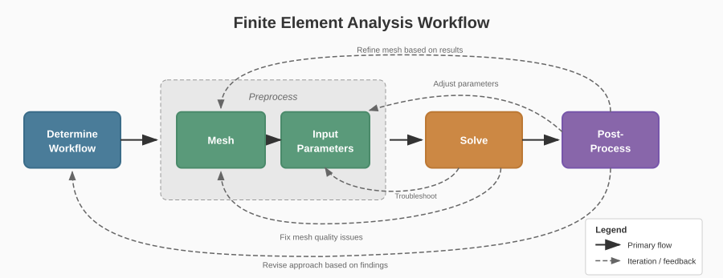{height="560" fig-align="center"}

::: {.columns}
::: {.column width="50%"}
**Problem:** FEA workflow: heavy dependency on manual expertise,
time-consuming, error-prone, and non-scalable, hard to transfer knowledge
:::
::: {.column width="50%"}
**Solution:** Collaborative AI: automates routine tasks, guides simulations,
improves efficiency and consistency, reduces errors, scalable, captures expert
knowledge
:::
:::

## Can you spot the difference? {.section-header}

::: {.columns}
::: {.column width="50%"}
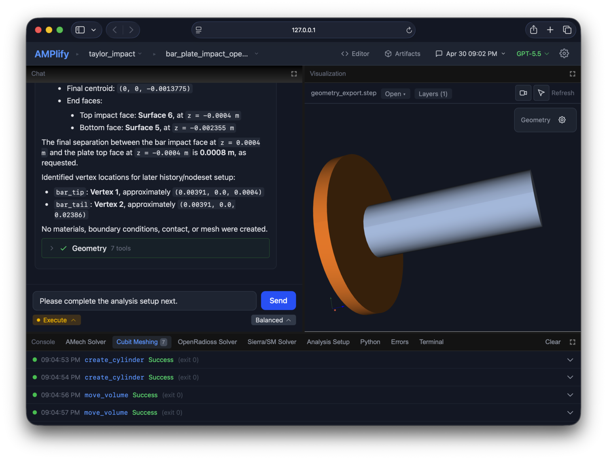

**Built in days**
:::
::: {.column width="50%"}


**Built in months**
:::
:::

## The differences are under the hood

| Built in Days | Built in Months |
|---|---|
| **Unanchored agent:** Relies heavily on LLM for decisions. | **Anchored agent:** The LLM interprets intent. Deterministic code handles whatever must be exact. |
| **Error-laundering:** LLMs hallucinate. Insidious errors propagate silently. | **Error-mitigating:** Propagation paths are eliminated. Correct-by-construction. |
| **Quality liability:** Errors generated faster than manual workflows, passing heavy review burdens to analysts. | **Invisible rigor:** Verification by construction. The review burden moves from catching mistakes to preventing them. |

> You will make more mistakes, or have an immense mental burden of keeping up
> with the pace of AI

## Exemplar Problem Suite {.smaller}

Small set of problems. Intentionally easy for automation. Full automation is
not our goal.

::: {style="font-size: 0.62em; line-height: 1.15;"}
::: {.columns}
::: {.column width="50%"}
**E001: Uniaxial Tension Bar**

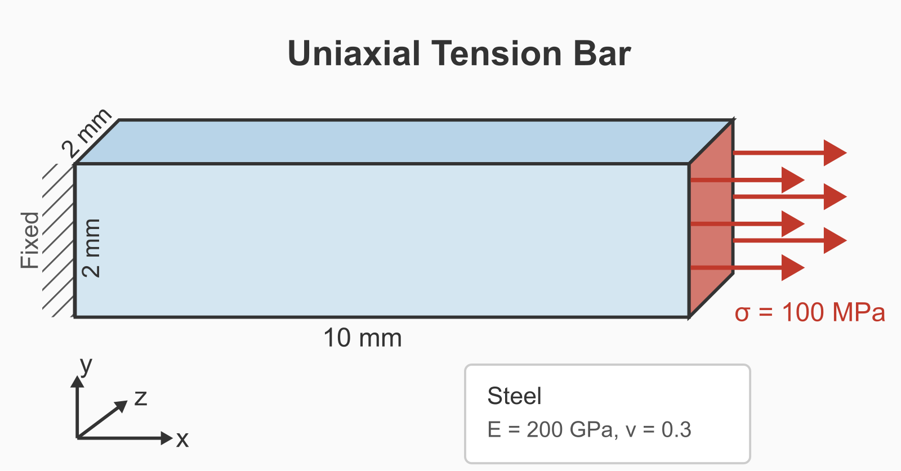{height="150"}

**Geometry**: Rectangular bar, 10 mm × 2 mm × 2 mm, extending from x = 0 to x = 10 mm

**Material**: Linear elastic steel (E = 200 GPa, ν = 0.3)

**Boundary Conditions**: Fixed: x = 0 face (all DOFs constrained). Traction: x = 10 mm face, σ = 100 MPa in +x direction

**Expected Results** (closed-form: σ = F/A, ε = σ/E, δ = εL):

| Quantity | Location (mm) | Value | Tolerance |
|---|---|---|---|
| Axial stress σ_xx | (5.0, 1.0, 1.0) | 100 MPa | ±5% |
| Axial displacement u_x | (10.0, 1.0, 1.0) | 0.005 mm | ±10% |

**Mesh Requirements**: Exactly 40 hex elements (~1 mm element size)
:::
::: {.column width="50%"}
**E002: Pressurized Cylinder (Quarter Symmetry)**

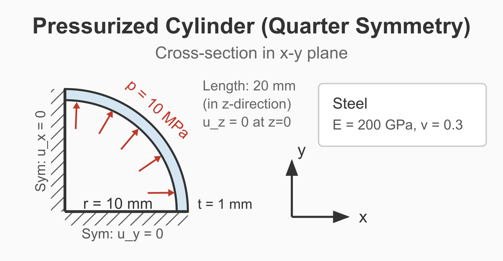{height="150"}

**Geometry**: Quarter-cylinder section. Inner radius: 10 mm. Wall thickness: 1 mm (outer radius 11 mm). Length: 20 mm (along z-axis). Quarter section spans x ≥ 0, y ≥ 0 (first quadrant)

**Material**: Linear elastic steel (E = 200 GPa, ν = 0.3)

**Boundary Conditions**: Internal pressure: 10 MPa on inner curved surface. Symmetry BC on x = 0 plane (fix x-displacement). Symmetry BC on y = 0 plane (fix y-displacement). Fix z-displacement on z = 0 end face

**Expected Results** (thin-wall approximation: σ_θ = pr/t = 10 × 10 / 1 = 100 MPa):

| Quantity | Location (mm) | Value | Tolerance |
|---|---|---|---|
| Hoop stress σ_yy | (10.5, 0.0, 10.0) | 100 MPa | ±10% |

**Mesh Requirements**: 200–2000 hex elements (~1 mm element size)
:::
:::
::: {.columns}
::: {.column width="50%"}
**E003: Cantilever Beam**

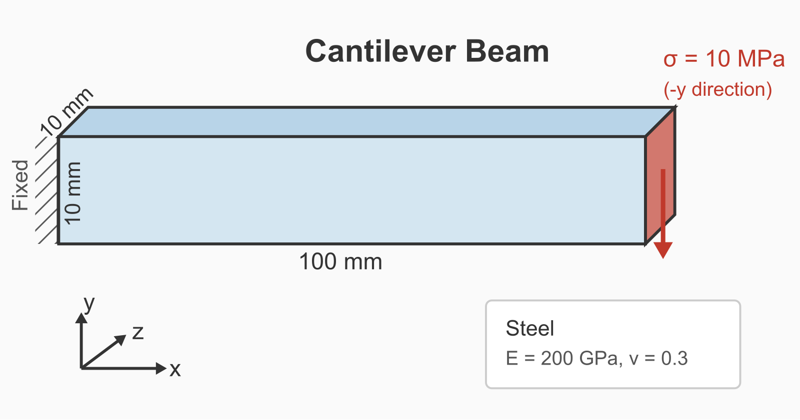{height="150"}

**Geometry**: Rectangular beam, 100 mm × 10 mm × 10 mm. Beam extends from x = 0 to x = 100 mm. Cross-section: y from 0 to 10 mm, z from 0 to 10 mm

**Material**: Linear elastic steel (E = 200 GPa, ν = 0.3)

**Boundary Conditions**: Fixed: x = 0 face (all DOFs constrained). Traction: x = 100 mm face, 10 MPa in −y direction (total force 1000 N over 10 × 10 mm face)

**Expected Results** (Timoshenko beam theory: δ = PL³/3EI, where I = bh³/12):

| Quantity | Location (mm) | Value | Tolerance |
|---|---|---|---|
| Tip deflection u_y | (100.0, 5.0, 5.0) | −2.0 mm | ±20% |

**Mesh Requirements**: 50–500 hex elements (~5 mm element size)
:::
::: {.column width="50%"}
**E004: Cook's Membrane**

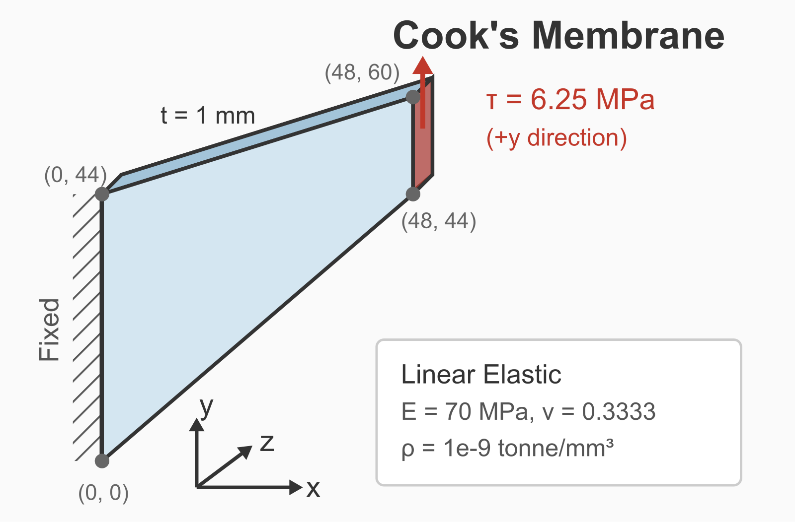{height="150"}

**Geometry**: Tapered quadrilateral plate (trapezoidal in XY plane, extruded in Z). Left edge (x = 0): y from 0 to 44 mm (height 44 mm). Right edge (x = 48 mm): y from 44 to 60 mm (height 16 mm). Bottom edge: connects (0, 0) to (48, 44). Top edge: connects (0, 44) to (48, 60). Thickness: 1 mm in z-direction (z = 0 to z = 1 mm)

**Material**: Linear elastic (E = 70 MPa, ν = 0.3333, ρ = 1×10⁻⁹ tonne/mm³)

**Boundary Conditions**: Fixed: x = 0 face (all DOFs constrained). Plane strain: fix z-displacement on z = 0 and z = 1 faces. Shear traction: x = 48 mm face, 6.25 MPa in +y direction (total shear force 100 N)

**Expected Results** (CoFEA benchmark):

| Quantity | Location (mm) | Value | Tolerance |
|---|---|---|---|
| Vertical displacement u_y | (48.0, 60.0, 0.5) | 32 mm | ±10% |

**Mesh Requirements**: 50–2000 elements (hex or tet, ~4–5 mm element size)
:::
:::
:::

## What the agent is actually asked

::: {.columns}
::: {.column width="58%"}
```
Create a rectangular bar 10mm x 2mm x 2mm. The bar
extends from x=0 to x=10mm. Mesh with hex elements,
roughly 1mm element size. Fix the end at x=0, apply
100 MPa tension at x=10. Material: steel, E=200 GPa,
nu=0.3. Use the static solver to solve the problem.
Include cauchy_stress in the output fields. Report
the computed stress. The task is not complete until
the solver has run.

Do not ask clarifying questions. Make reasonable
assumptions for any unspecified details.
```
:::
::: {.column width="42%"}
{width="100%" fig-align="center"}
:::
:::

## The difference, measured

| Stage | Pass rate |
|---|---|
| Baseline: one-shot script generation | **7%** |
| \+ unit consistency pipeline | **26%** |
| \+ closed-loop execution | **93%** |

Same models. Same problems. Same prompts.

## Pass Rates: Architecture, Not Model Choice

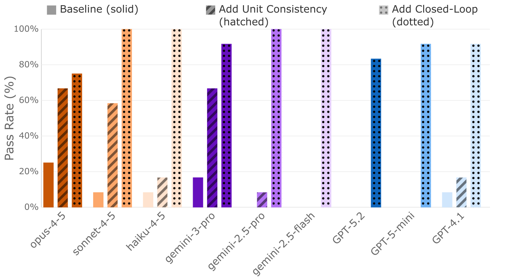{height="560" fig-align="center"}

**Architecture, not model choice, is what works.**

Open-weights Qwen3 14B on a laptop: **75%** — first feasibility evidence for
air-gapped deployment

## Where this goes

1. What an anchored agent looks like, running
2. **Units**: where multi-agent systems break, and the one-line fix. 7 to 26.
3. **Observe, do not predict**: the 26 to 93 story
4. **Namespace quarantine**: what phases may and may not see
5. How you know any of it works
6. Where the anchors run out, and who is left holding the problem

# AMPlify, running {.section-header}

## {background-color="black"}

```{=html}
<video controls muted preload="metadata" src="media/bracket_demo.mp4"
       style="display:block; margin:0 auto; width:100%; max-height:96vh; object-fit:contain;">
</video>
```

# Units {.section-header}

## Solvers are dimensionless

If the geometry is in millimeters, the modulus has to be in MPa.

Get it wrong and the answer is off by orders of magnitude. **Silently.** The
contour plot looks entirely reasonable.

Mars Climate Orbiter: $125M, one unit mismatch.

## The handoff

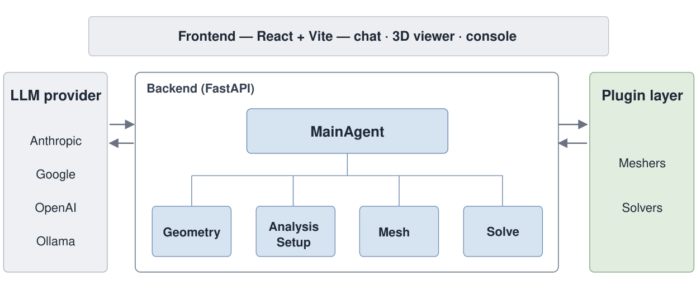{height="600" fig-align="center"}

The main agent, an LLM, reads the request and dispatches each phase. The
geometry agent builds the part. The setup agent writes the material block.
They share one thing, the **shared state**: a small record each phase reads and
writes. Neither one sees the other's conversation.

## The problem

::: {.columns}
::: {.column width="55%"}
The uniaxial bar from the exemplar suite, split the way a phased system
splits it:

**Geometry agent:** *Create a rectangular bar 10mm x 2mm x 2mm. The bar extends from x=0 to x=10mm.*

**Setup agent:** *Write the material and loading values. Fix the end at x=0, apply 100 MPa tension at the x=10 face. Material: steel, E=200 GPa, nu=0.3.*

A consistent mm deck needs **E = 200000 MPa** and **traction = 100 MPa**.
:::
::: {.column width="45%"}
{width="100%"}
:::
:::

**[LIVE: `python unit_demo.py --step`]**

## The geometry agent

::: {.columns}
::: {.column width="50%"}
**Input**

```
You are the geometry agent. Build the requested part in the CAD engine.
Reply with Cubit journal commands only, no commentary.

Create a rectangular bar 10mm x 2mm x 2mm. The bar extends from x=0 to x=10mm.
```
:::
::: {.column width="50%"}
**Output**

```
create brick x_interval 0 10 y_interval -1 1 z_interval -1 1
```

**The shared state, after geometry and meshing**

```
Shared analysis state:
  geometry: volume_1 (bar), meshed, 40 hex elements
  named surfaces: fixed_end, load_face
```
:::
:::

Ten. Not ten millimeters; the engine has no such thing. **No unit is stored
anywhere.**

## The setup agent

::: {.columns}
::: {.column width="55%"}
**Input** (fresh context; it never sees the previous slide)

```
You are the solver setup agent. Write the material and loading values for the
input deck, using the shared analysis state you are given.

Return JSON only:
{"youngs_modulus": <number>, "poisson": <number>, "traction": <number>}

Shared analysis state:
  geometry: volume_1 (bar), meshed, 40 hex elements
  named surfaces: fixed_end, load_face

Write the material and loading values. Fix the end at x=0, apply 100 MPa tension at the x=10 face. Material: steel, E=200 GPa, nu=0.3.
```
:::
::: {.column width="45%"}
**Output**

```
{
  "youngs_modulus": 200000000000,
  "poisson": 0.3,
  "traction": 100000000
}
```

2e11 is **pascals**. The part in the engine is **ten units long**.

Every stress this deck reports is off by a factor of a million, in a file no
schema rejects. (On this bar the displacement survives, because E and the load
scaled together.) **Six times out of six.**

*Six runs of gemini-2.5-flash at temperature 0, a fresh context each time.*

::: {.fragment}
Of 95 unit failures in our exemplar runs, **78** look exactly like this.
Sonnet, Opus, Gemini Pro, Haiku.
:::
:::
:::

::: {.fragment}
**Unanchored.** *Relies heavily on LLM for decisions.* The unit was left to the
main agent to pass along. It did not.
:::

## Give it everything

::: {.columns}
::: {.column width="55%"}
**Input** (same instructions; the state now carries the engine's bounding
box, and the analyst's whole request is forwarded)

```
Shared analysis state:
  geometry: volume_1 (bar), meshed, 40 hex elements
  bounding box: (0, -1, -1) to (10, 1, 1)
  named surfaces: fixed_end, load_face

The analyst's original request: "Create a rectangular bar 10mm x 2mm x 2mm. The bar extends from x=0 to x=10mm. Write the material and loading values. Fix the end at x=0, apply 100 MPa tension at the x=10 face. Material: steel, E=200 GPa, nu=0.3."

Now write the material and loading values for the deck.
```
:::
::: {.column width="45%"}
**Output**

```
{
  "youngs_modulus": 200000000000,
  "poisson": 0.3,
  "traction": 100000000
}
```

"10mm" in the request. "10" from the engine. **It does not connect them.
Six times out of six.**
:::
:::

## Write it down

::: {.columns}
::: {.column width="55%"}
**Input** (same instructions; one field added to the state: here by hand, in
the anchored design by deterministic code, next slide)

```
Shared analysis state:
  unit_system: mm-N-MPa
  geometry: volume_1 (bar), meshed, 40 hex elements
  named surfaces: fixed_end, load_face

Write the material and loading values. Fix the end at x=0, apply 100 MPa tension at the x=10 face. Material: steel, E=200 GPa, nu=0.3.
```
:::
::: {.column width="45%"}
**Output**

```
{
  "youngs_modulus": 200000,
  "poisson": 0.3,
  "traction": 100
}
```

**Six times out of six.**
:::
:::

| the setup agent was given | result |
|---|---|
| shared state only | 6/6 wrong |
| full request + bounding box | 6/6 wrong |
| `unit_system: mm-N-MPa` in the state | **6/6 right** |

*Every cell: gemini-2.5-flash, six runs at temperature 0, fresh context each run.*

**Anchored.** *The LLM interprets intent. Deterministic code handles whatever
must be exact.* Code decides the unit system once and writes it here. No agent
has to carry it; none can forget it.

## Example of Anchoring: Unit Consistency

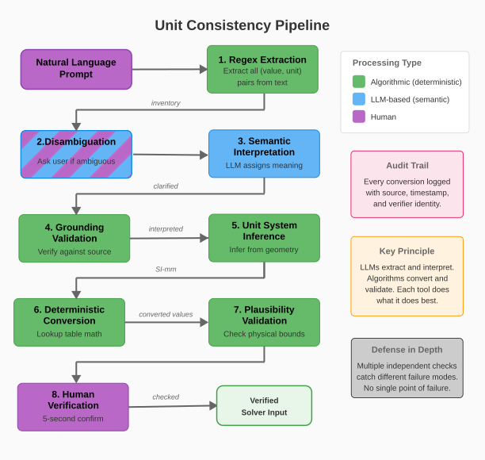{height="720" fig-align="center"}

## Now you try {.qr-beside}

::: {style="float:right;width:250px;text-align:center;margin:0 0 0.5em 1.5em;"}
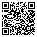{width="230"}
<div style="font-size:0.45em;line-height:1.2;">github.com/aperijake/<br>agentic-cae-tutorial</div>
:::

Three mocked agents in one file: main, geometry, setup. They share one small
state. A check in code says whether the deck is right. Break it, then fix it.

1. `git clone https://github.com/aperijake/agentic-cae-tutorial`
2. `pip install openai`, then `export GEMINI_API_KEY=...` (your key from this morning)
3. Open `playground.py`. Three instruction strings at the top, then `run_one_request`: seven steps.
4. `python playground.py`. The millimeter bar is wrong. The meter bar is right.
5. Tell the setup agent to always use mm-N-MPa. Run it. Which bar breaks now?
6. Tell the main agent to pass the unit along. `python playground.py --runs 3`. Count.
7. Uncomment the line marked THE STUDENT CHANGE, or run with `--anchor`. No instruction changed.

# Observe, do not predict {.section-header}

## Boolean operations change the ids

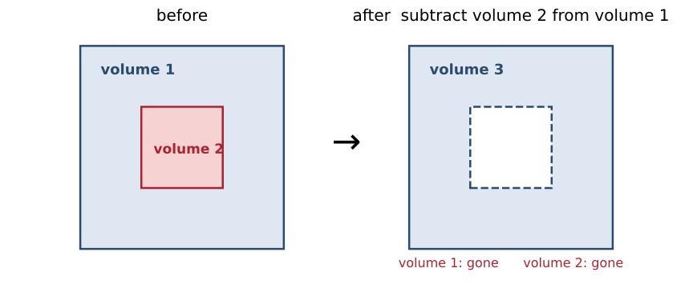{height="400" fig-align="center"}

```
subtract volume 2 from volume 1
  Updated volume(s): 3
  Destroyed volume(s): 2
mesh volume 1
  ERROR: No volume with ID 1 was found
```

The model wrote the whole script in advance, predicting state it could not
predict. **Measured:** that error is in 322 log files from our exemplar runs,
every model family, all from before closed-loop execution.

## Closed-loop execution

**One command. Observe the result. Then decide the next one.**

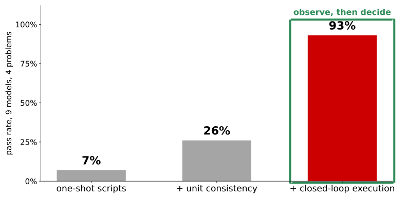{height="600" fig-align="center"}

## The general rule

> Never let a model predict state it could have observed.

Anywhere your system asks the model to remember what happened instead of
looking, you have built a place where it will confidently be wrong.

Where it bites:

- node and element numbering after a remesh
- block and sideset ids after an import
- which load step a results file is on
- whether the export actually wrote

# What each agent can see {.section-header}

## One agent, every tool

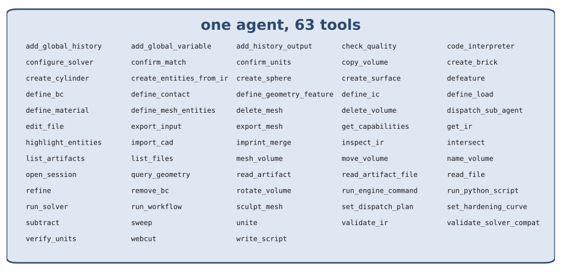{height="520" fig-align="center"}

**Give each agent a smaller job.** Split the tools and decisions across
focused sub-agents, with a main agent that dispatches the work.

## Each phase runs alone

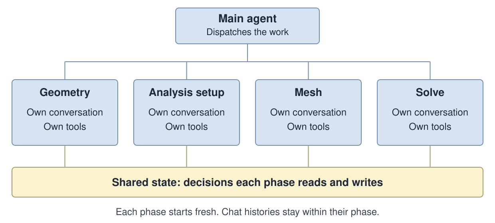{height="560" fig-align="center"}

**Some details only make sense within their phase.** Keep each phase's
conversation and tools separate: **namespace quarantine**.

## Some state must be agreed on

> Another consequence of multi-stage generation: the meshing agent names a
> surface `fixed_end`, the solver agent references `fixed_boundary`. Both
> reasonable, but they don't match.

::: {.columns}
::: {.column width="50%"}
**What the two phases wrote**

```
# meshing stage
sideset 1 surface 3
sideset 1 name 'fixed_end'

# solver config, generated separately
boundary_conditions:
  - region: fixed_boundary
    displacement: [0, 0, 0]
```
:::
::: {.column width="50%"}
**What the check says, between the phases**

```
status: errors
$.boundary_conditions[0].feature_ref
Boundary condition 'bc_0' references
unknown feature 'fixed_boundary'
```
:::
:::

**Shared record (simplified):** `boundary: fixed_end` · `unit_system: mm-N-MPa`

Both phases use `fixed_end` from that record. A different name is rejected.

**Keep local context separate. Share the decisions that must match.**

# Look at the result {.section-header}

## Cook's membrane

::: {.columns}
::: {.column width="60%"}
{width="100%" fig-align="center"}
:::
::: {.column width="40%"}
**Same geometry and loading.**

Poisson's ratio changes:

**ν = 0.3333 to 0.4999**

Reference tip displacement at **ν = 0.4999**:

**27.3 to 28.0 mm**
:::
:::

## Three formulations, one mesh

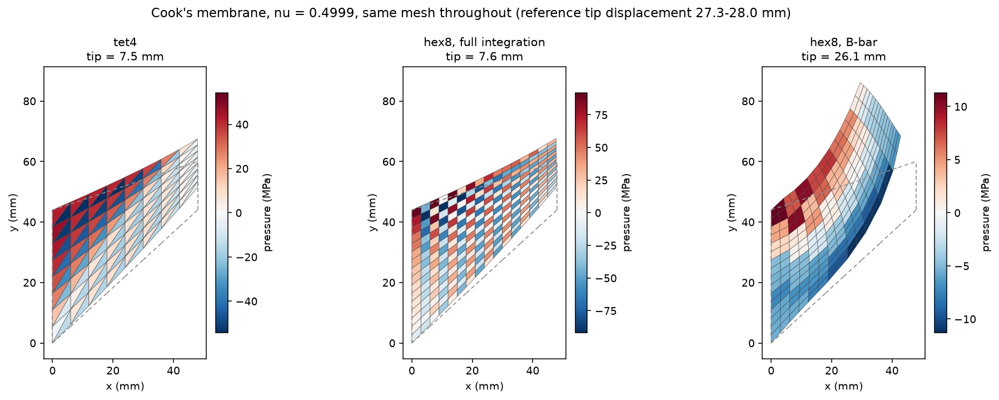{height="640"}

## The plot you would normally make

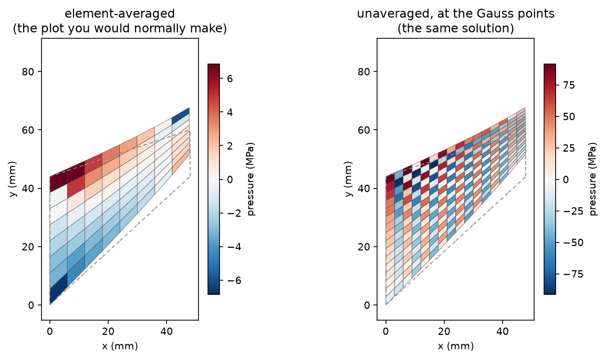{height="620"}

Same solution. Left: element averaged. Right: unaveraged.

## Now you try: give the agent eyes {.qr-beside}

::: {style="float:right;width:250px;text-align:center;margin:0 0 0.5em 1.5em;"}
{width="230"}
<div style="font-size:0.45em;line-height:1.2;">github.com/aperijake/<br>agentic-cae-tutorial</div>
:::

One script. Solve, snapshot the pressure field, send the picture, ask.

1. Run `python look.py`. When it pauses, open `snapshot.png`. Describe what you see before reading the model's answer.
2. Without the picture the model has a log and a number. With it, it names the checkerboard.
3. `FORMULATION = "bbar"`. Run. The picture is smooth; nothing is named.
4. `AVERAGED = True`. The plot you would normally make. `python look.py --runs 5`. Count.
5. Change `QUESTION`. Run five times. Count again.
6. After the verdict it is offered `full` and `bbar` and asked to pick. It picks, code reruns, it looks again.

## From observation to evidence

Ask the agent what it sees.

Ask what would confirm or challenge its interpretation.

**Run those checks together—and make useful checks repeatable.**

## Take it home {.qr-beside}

::: {style="float:right;width:250px;text-align:center;margin:0 0 0.5em 1.5em;"}
{width="230"}
<div style="font-size:0.45em;line-height:1.2;">github.com/aperijake/<br>agentic-cae-tutorial</div>
:::

[github.com/aperijake/agentic-cae-tutorial](https://github.com/aperijake/agentic-cae-tutorial)

- **`playground.py`** — experiment with agent handoffs and shared state.
- **`look.py`** — send simulation images to an LLM and examine its interpretation.
- **`extras/`** — build a tool-using agent and expose tools through MCP.

**Start with the README. The two hands-on exercises need an API key.**

::: {style="margin-top: 2.5em;"}
Jake Koester\
[jake.koester@apericmc.com](mailto:jake.koester@apericmc.com)
:::

